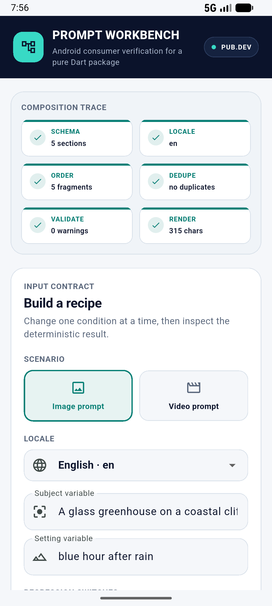
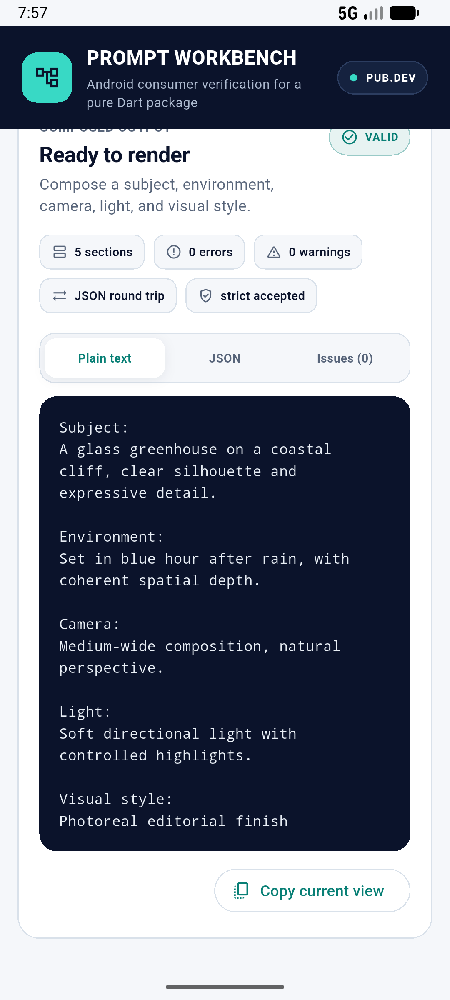

# Prompt Workbench for Android

An independent Flutter Android consumer app for verifying the public
[`aigc_prompt_composer`](https://pub.dev/packages/aigc_prompt_composer) Dart
package in a real mobile runtime.

The app depends on the hosted `0.1.0-dev.3` archive. It deliberately does not
use a local path dependency, so every run exercises the same package artifact a
pub.dev user receives.

## What the workbench verifies

- User-defined image and video prompt schemas
- Deterministic section and fragment ordering
- Variable resolution
- Locale selection and `fr-FR` to English fallback
- Fragment deduplication by identifier
- Required-section and fragment-conflict validation
- Result-oriented `compose()` and strict `composeOrThrow()` behavior
- Plain-text and structured JSON renderers
- Schema, recipe, options, and composed-result serialization round trips

The regression switches intentionally inject duplicates, conflicts, and a
missing required section. The composition trace shows exactly where the result
passed, emitted a notice, or became blocked.

## Android preview

<p align="center">
  
  
</p>

## Run locally

Requirements:

- Flutter 3.44.8 or a compatible stable release
- Android SDK and an Android device or emulator

```powershell
flutter pub get
flutter analyze
flutter test
flutter emulators
flutter run -d <android-device-id>
```

Run the device-level flow:

```powershell
flutter test integration_test/app_test.dart -d <android-device-id>
```

The integration command temporarily builds an APK whose Dart entry point is the
test runner. Before manually installing `app-debug.apk`, rebuild the normal app:

```powershell
flutter build apk --debug --target lib/main.dart
```

Build an installable test APK:

```powershell
flutter build apk --release
```

Output:

```text
build/app/outputs/flutter-apk/app-release.apk
```

The release build uses the generated debug signing configuration because this
repository is a verification app, not a Play Store distribution project.

## Repository boundary

This repository contains only the Flutter consumer app. The package under test
remains an independent pure Dart package without a Flutter runtime dependency.
There are no provider clients, network calls, API credentials, persistence, or
application-specific product concepts in this demo.

## Continuous integration

The GitHub Actions workflow checks formatting, static analysis, widget/unit
tests, a debug APK build, and the integration flow on an Android emulator.

## License

MIT. See [LICENSE](LICENSE).
